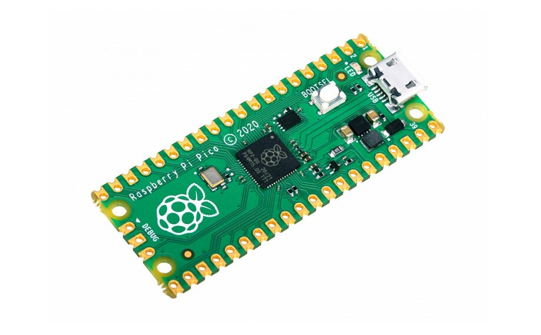
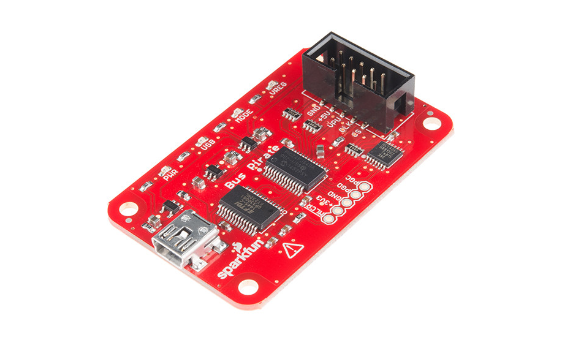
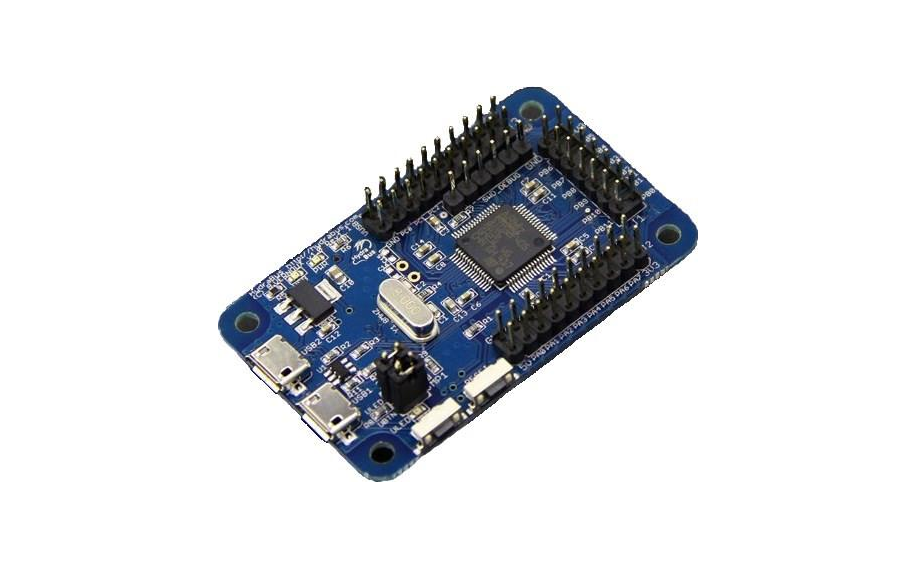

# HardwareHackingMaterials
This is a repository of training materials and interesting reads for everything related to hardware hacking.

# TOC
- 🎥 Videos 🎥
- 📖 Books 📖
- 👾 Tools (and software therefore) 👾
- 👨🏻‍💻 Software 👨🏻‍💻

# 🎥 Videos 🎥

## Intro:
- [Joe Grand's Hardware Hacking Basics](https://youtu.be/EI9wiOgNl8U)
- [Samy Kamkar's Crash Course in How to Be a Hardware Hacker](https://youtu.be/tlwXmNnXeSY?si=q3FM2dbISca98hww)
- [Intro to hardware security: UART access and SPI firmware extraction](https://www.youtube.com/watch?v=YD6ODeER8qM)

# 📖 Books 📖

- [The Hardware Hacking Handbook](https://nostarch.com/hardwarehacking)
- [Practical IoT Hacking](https://nostarch.com/practical-iot-hacking)

# 👾 Tools 👾

## Microcontrollers:

### RP 2040

#### Software:
- [DragonProbe](https://git.lain.faith/sys64738/DragonProbe) \
Adding Bus Pirate/..-style debugging & probing features to regular MCU boards such as the Raspberry Pi Pico

- [xvc-pico](https://github.com/kholia/xvc-pico/) \
This project implements a Raspberry Pico based Xilinx Virtual Cable (XVC). It allows using Raspberry Pico as a JTAG adapter for programming Xilinx FPGAs

### Bus Pirate

### HydraBus

